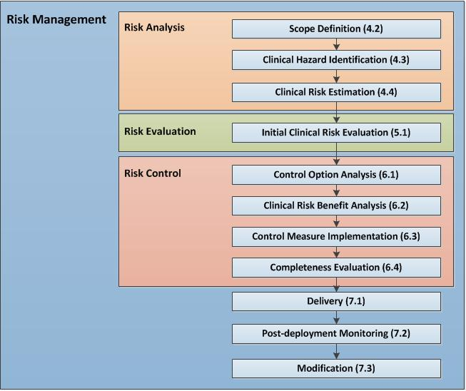

> Copyright © 2018 NHS Digital

# DCB 0129

## Clinical Risk Management: its Application in the Manufacture of Health IT Systems

# Specification

Document filename: DCB0129 Specification v4.2.docx
Directorate Operations and Assurance Services
Project Clinical Safety
Document Reference NPFIT-FNT-TO-TOCLNSA-1792.
Director Debbie Chinn
Status Approved
Owner Stuart Harrison Version 4.
Author Sean White
Version issue date 02.05.2018

Clinical Risk Management: its Application in the Manufacture of Health IT Systems - Specification v4.
**02. 05.**

## Document Management

### Revision History

Version Date Summary of Changes
0.1 06.10.2012 First draft for comment
0.2 20.11.2012 First draft for issue to Information Standards Management Service
0.3 06.12.2012 Revised to address comments from external appraisers
0.4 03.01.2013 Revised to address comments from external appraisers. For approval.
1.0 14.01.2013 First issue
1.1 17.01.2012 Incorporation of review comments from Information Standards
Management Service
2.0 21.01.2013 Approved
3.0 24.01.2013 Amended and Approved by ISMS Domain Leadership
4.0 08.12.2015 Amended and Approved to reflect change made to Requirement 2.
(Non-health products and COTS is now Third party products)
4.1 16.08.2016 NHS Digital Rebranded
4.2 02. 05 .2018 Change to include Medical Device Software and new Data Coordination
Board reference

### Reviewers

This document must be reviewed by the following people:
Reviewer name Title / Responsibility Date Version
NHS Digital Clinical Safety Group 02. 05 .2018 4.

### Approved by

This document must be approved by the following people:

Name Title Date Version
Dr Manpreet Pujara Clinical Director for Patient Safety 02. 05 .2018 4.
Debbie Chinn Director of Solution Assurance 02. 05 .2018 4.
Publication Copy 4.

Data Coordination Board

This information standard (DCB0129) has been approved for publication by the

Department of Health and Social Care under section 250 of the Health and Social

Care Act 2012.

Assurance that this information standard meets the requirements of the Act and is

appropriate for the use specified in the specification document has been provided by

the Data Coordination Board (DCB), a sub-group of the Digital Delivery Board.

This information standard comprises the following documents:

- Requirements Specification
- Implementation Guidance
- Change Specification.

An Information Standards Notice (DCB0129 Amd 24/2018) has been issued as a

notification of use and implementation timescales. Please read this alongside the

documents for the standard.

The controlled versions of these documents can be found on the NHS Digital website.

Any copies held outside of that area, in whatever format (e.g. paper, email

attachment), are considered to have passed out of control and should be checked for

currency and validity.

Date of publication: 7 June 2018

### Related Documents:

These documents provide additional information and are specifically referenced within

this document.

Ref Doc Reference Number Title Version

1. DCB 0160 Amd 25/2018 Clinical Risk Management: its Application in the
   Deployment and Use of Health IT Systems:
   [http://www.digital.nhs.uk/isce/publication/DCB](http://www.digital.nhs.uk/isce/publication/DCB)

#### 4.

2. DCBI0129 Amd 24/2018 Clinical Risk Management: its Application in the
   Manufacture of Health IT Systems:
   [http://www.digital.nhs.uk/isce/publication/DCB](http://www.digital.nhs.uk/isce/publication/DCB)

#### 3.

3. 2017/745/EC The EU Regulation on Medical Devices
   2017/
4. ISO 14971:2012 Medical Devices: Application of Risk
   Management to Medical Devices

#### 2012

5. ALARP (HSE Website)
6. 0555 Healthcare risk assessment made easy, NPSA 2007
7. Managing competence for safety-related
   systems, HSE

#### 2007

8. RFC- 2119 Key words for use in RFCs to Indicate
   Requirement Levels, 1997

**Glossary of Terms:**

| Term                                                                   | Definition                                                                                                                                                                                                                                                                                                                                             |
| ---------------------------------------------------------------------- | ------------------------------------------------------------------------------------------------------------------------------------------------------------------------------------------------------------------------------------------------------------------------------------------------------------------------------------------------------ |
| Clinical Safety Officer (previously referred to as Responsible Person) | Person in a Manufacturer’s organisation responsible for ensuring the safety of a Health IT System in that organisation through the application of clinical risk management.                                                                                                                                                                            |
| Clinical risk                                                          | Combination of the severity of harm to a patient and the likelihood of occurrence of that harm.                                                                                                                                                                                                                                                        |
| Clinical risk analysis                                                 | Systematic use of available information to identify and estimate risk.                                                                                                                                                                                                                                                                                 |
| Clinical risk control                                                  | Process in which decisions are made and measures implemented by which clinical risks are reduced to, or maintained within specified levels.                                                                                                                                                                                                            |
| Clinical risk estimation                                               | Process used to assign values to the severity of harm to a patient and the likelihood of occurrence of that harm.                                                                                                                                                                                                                                      |
| Clinical risk evaluation                                               | Process of comparing a clinical risk against given risk criteria to determine the acceptability of the clinical risk.                                                                                                                                                                                                                                  |
| Clinical risk management                                               | Systematic application of management policies, procedures and practices to the tasks of analysing, evaluating and controlling clinica risk.                                                                                                                                                                                                            |
| Clinical Risk Management File                                          | Repository of all records and other documents that are produced by the clinical risk management process.                                                                                                                                                                                                                                               |
| Clinical Risk Management Plan                                          | A plan which documents how the Manufacturer will conduct clinical management of a Health IT System.                                                                                                                                                                                                                                                    |
| Clinical Risk Management Process                                       | A set of interrelated or interacting activities, defined by the Manufacturer, to meet the requirements of this standard with the objective of ensuring clinical safety in respect to the development and modification of a Health IT System.                                                                                                           |
| Clinical safety                                                        | Freedom from unacceptable clinical risk to patients.                                                                                                                                                                                                                                                                                                   |
| Clinical Safety Case                                                   | Accumulation and organisation of product and business process documentation and supporting evidence, through the lifecycle of a Health IT System.                                                                                                                                                                                                      |
| Clinical Safety Case Report                                            | A report that presents the arguments and supporting evidence that provides a compelling, comprehensible and valid case that a system is safe for a given application in a given environment at a defined point in a Health IT System’s lifecycle.                                                                                                      |
| Harm                                                                   | Death, physical injury, psychological trauma and/or damage to the health or well-being of a patient.                                                                                                                                                                                                                                                   |
| Hazard                                                                 | Potential source of harm to a patient.                                                                                                                                                                                                                                                                                                                 |
| Hazard Log                                                             | A mechanism for recording and communicating the on-going identification and resolution of hazards associated with a Health IT System.                                                                                                                                                                                                                  |
| Health Organisation                                                    | Organisation within which a Health IT System is deployed or used for a healthcare purpose.                                                                                                                                                                                                                                                             |
| Health IT System                                                       | Product used to provide electronic information for health or social care purposes. The product may be hardware, software or a combination.                                                                                                                                                                                                             |
| Initial clinical risk                                                  | The clinical risk derived during clinical risk estimation taking into consideration any retained risk control measures.                                                                                                                                                                                                                                |
| Intended use                                                           | Use of a product, process or service in accordance with the specifications, instructions and information provided by the manufacturer to customers.                                                                                                                                                                                                    |
| Issue                                                                  | The process associated with the authoring of a document. This process will include: reviewing, approval and configuration control.                                                                                                                                                                                                                     |
| Likelihood                                                             | Measure of the occurrence of harm.                                                                                                                                                                                                                                                                                                                     |
| Lifecycle                                                              | All phases in the life of a Health IT System, from the initial conception to final decommissioning and disposal.                                                                                                                                                                                                                                       |
| Manufacturer                                                           | Person or organisation with responsibility for the design, manufacture, packaging or labelling of a Health IT System, assembling a system, oradapting a Health IT System before it is placed on the market and/or put into service, regardless of whether these operations are carried out by that person or on that person's behalf by a third party. |
| Patient                                                                | A person who is the recipient of healthcare.                                                                                                                                                                                                                                                                                                           |
| Patient safety                                                         | Freedom from harm to the patient.                                                                                                                                                                                                                                                                                                                      |
| Post-deployment                                                        | That part of the lifecycle of a Health IT System after it has been manufactured, released, deployed and is ready for use by the Health Organisation.                                                                                                                                                                                                   |
| Procedure                                                              | Specified way to carry out an activity or a process.                                                                                                                                                                                                                                                                                                   |
| Process                                                                | Set of interrelated or interacting activities which transform inputs into outputs.                                                                                                                                                                                                                                                                     |
| Release                                                                | A specific configuration of a Health IT System delivered to a Health Organisation by the Manufacturer as a result of the introduction of new or modified functionality.                                                                                                                                                                                |
| Residual clinical risk                                                 | Clinical risk remaining after the application of risk control measures.                                                                                                                                                                                                                                                                                |
| Safety incident                                                        | Any unintended or unexpected incident which could have, or did, lead to harm for one or more patients receiving healthcare.                                                                                                                                                                                                                            |
| Safety Incident Management Log                                         | Tool to record the reporting, management and resolution of safety incidents associated with a Health IT System.                                                                                                                                                                                                                                        |
| Severity                                                               | Measure of the possible consequences of a hazard.                                                                                                                                                                                                                                                                                                      |
| Third party product                                                    | A product that is produced by another organisation and not by the Health IT System manufacturer. Examples include operating systems, library code, database and application servers and network components.                                                                                                                                            |
| Top Management                                                         | Person or group of people who direct(s) and control(s) an organisation and has overall accountability for a Health IT System.                                                                                                                                                                                                                          |

<!-- TOC -->

- [DCB 0129](#dcb-0129)
  - [Clinical Risk Management: its Application in the Manufacture of Health IT Systems](#clinical-risk-management-its-application-in-the-manufacture-of-health-it-systems)
- [Specification](#specification)
  - [Document Management](#document-management)
    - [Revision History](#revision-history)
    - [Reviewers](#reviewers)
    - [Approved by](#approved-by)
    - [Related Documents:](#related-documents)
      - [4.](#4)
      - [3.](#3)
      - [2012](#2012)
      - [2007](#2007)
  - [1 Overview](#1-overview)
    - [1.1 Summary](#11-summary)
  - [Management 2 General Requirements and Conformance Criteria for Clinical Risk](#management-2-general-requirements-and-conformance-criteria-for-clinical-risk)
  - [Criteria for Clinical Risk Management](#criteria-for-clinical-risk-management)
    - [2.1 Clinical Risk Management Process](#21-clinical-risk-management-process)
    - [2.2 Top Management responsibilities](#22-top-management-responsibilities)
    - [2.3 Clinical Safety Officer](#23-clinical-safety-officer)
    - [2.4 Competencies of personnel](#24-competencies-of-personnel)
    - [2.5 Third party products](#25-third-party-products)
    - [2.6 Regular clinical risk management process review](#26-regular-clinical-risk-management-process-review)
  - [3 Project Safety Documentation and Repositories](#3-project-safety-documentation-and-repositories)
    - [3.1 Clinical Risk Management File](#31-clinical-risk-management-file)
    - [3.2 Clinical Risk Management Plan](#32-clinical-risk-management-plan)
    - [3.3 Hazard Log](#33-hazard-log)
    - [3.4 Clinical Safety Case](#34-clinical-safety-case)
    - [3.5 Clinical Safety Case Reports](#35-clinical-safety-case-reports)
    - [3.6 Safety Incident Management Log](#36-safety-incident-management-log)
  - [4 Clinical risk analysis](#4-clinical-risk-analysis)
    - [4.1 Clinical risk analysis process](#41-clinical-risk-analysis-process)
    - [4.2 Health IT System scope definition](#42-health-it-system-scope-definition)
    - [4.3 Identification of hazards to patients](#43-identification-of-hazards-to-patients)
    - [4.4 Estimation of the clinical risks](#44-estimation-of-the-clinical-risks)
  - [5 Clinical risk evaluation](#5-clinical-risk-evaluation)
    - [5.1 Initial clinical risk evaluation](#51-initial-clinical-risk-evaluation)
  - [6 Clinical risk control](#6-clinical-risk-control)
    - [6.1 Clinical risk control option analysis](#61-clinical-risk-control-option-analysis)
    - [6.2 Clinical risk benefit analysis](#62-clinical-risk-benefit-analysis)
    - [6.3 Implementation of clinical risk control measures](#63-implementation-of-clinical-risk-control-measures)
    - [6.4 Completeness of clinical risk control](#64-completeness-of-clinical-risk-control)
  - [7 Delivery, Monitoring and Modification](#7-delivery-monitoring-and-modification)
    - [7.1 Delivery](#71-delivery)
    - [7.2 Post-deployment monitoring](#72-post-deployment-monitoring)
    - [7.3 Modification](#73-modification)

<!-- /TOC -->

## 1 Overview

### 1.1 Summary

It is widely accepted that the provision and deployment of Health IT Systems within the
National Health Service (NHS) can deliver substantial benefits to NHS patients through the
timely provision of complete and correct information to those healthcare professionals that
are responsible for administering care.

The use of such Health IT Systems is becoming increasingly widespread and the functionality is becoming more sophisticated. However, it must be recognised that failure or incorrect use of such systems have the potential to cause harm to those patients that the system is intended to benefit. The purpose of this standard is to promote and ensure that effective clinical risk management is carried out by organisations that are responsible for developing and modifying Health IT Systems. This purpose is achieved through the presentation of a set of requirements. Within this standard the term ‘clinical risk’ is used to emphasise that the scope is limited to the management of risks related to patient safety as distinct from other types of risk such as financial. Clinical risk management may be conducted within the context of an overall risk management system operated by the Manufacturer and any wider health information governance processes. Wherever practical, existing risk management processes would be adapted and used to address the requirements of this standard. The extent of clinical risk management needs only to be commensurate with the scale, complexity and level of clinical risk associated with the deployment. The Manufacturer’s clinical risk management processes should be flexible to facilitate this. This standard is supported by implementation guidance [Ref. 2] which contains an explanatory narrative which will aid in the interpretation and application of this standard. This standard complements DCB 0160 [Ref. 1]. This standard is addressed to Manufacturer personnel who are responsible for ensuring clinical safety in the development and modification of Health IT Systems through the application of clinical risk management. This standard applies to all Health IT Systems including those that are also controlled by medical device regulations [Ref. 3], though the requirements defined in this standard are broadly consistent with the requirements of ISO 14971 [Ref. 4].

Release

Release Number Amd 24/

Release Title Version 4.

Description This change focusses on aligning NHS Digital Clinical Safety standards
with the new medical devices regulations for stand alone software. The
change provides clarity and removes uncertainty among users and
developers with regard to the registration of software as a medical device
and compliance with this standard. The evidence of this statement comes
from academic and industry advisors, and recent experiences with devices
in use that are decision making or supporting and integrated into
unregulated software.
The new Medical Devices Regulation was published by the European
Commission in May 2017.
A summary would include:

- Software is specifically identified as a type of medical device. This
  will broaden the number of software solutions that are a medical
  device.
- Classification now includes risk as a component, in line with the
  NHS Digital Clinical Safety standards. This is important to note.
- The regulation includes additional essential requirements in the
  fields of:
  - IT environment
  - Interoperability
  - Cybersecurity
  - Mobile platforms
  - IT network and IT security.

This change in scope of the clinical risk management of health IT within the
NHS Digital Clinical Safety standards provides a means of asserting
compliance with this standard for the design, build, deployment and
maintenance of software in conformance to a “harmonised” manner and in
line with the medical devices regulations. A harmonised standard is a
European standard developed by a recognised European Standards
Organisation following a request from the European Commission.
Implementation
Completion Date

1 July 2018

## Management 2 General Requirements and Conformance Criteria for Clinical Risk

## Criteria for Clinical Risk Management

The following requirements use either MUST or SHOULD as defined by RFC- 2119 [Ref. 8],

where:

- MUST: “means that the definition is an absolute requirement of the specification”
- SHOULD: “means that there may exist valid reasons in particular circumstances to ignore
  a particular item, but the full implications must be understood and carefully weighed
  before choosing a different course”.

In order to claim conformance with this Specification, a Manufacturer MUST implement the
clinical risk analysis activities defined in sections 2 to 7, within the bounds of the definitions above.

### 2.1 Clinical Risk Management Process

2.1.1 The Manufacturer MUST define and document a clinical risk management
process which recognises the risk management activities shown in Figure 1.
Note: the numbers shown in parentheses in this figure refer to sections later in
this document.

Figure 1 Clinical Risk Management Process

### 2.2 Top Management responsibilities

2.2.1 In implementing the clinical risk management process for a given deployment,
Top Management MUST:

- make available sufficient resources
- assign competent personnel (see section 2.4) from each of the specialist areas
  that are involved in developing and assuring the Health IT System
- nominate a Clinical Safety Officer.

  2.2.2 Top Management MUST ensure that appropriate levels of authorisation for the
  Health IT System and its safety documentation are defined in the Clinical Risk
  Management Plan.

### 2.3 Clinical Safety Officer

2.3.1 A Clinical Safety Officer MUST be a suitably qualified and experienced clinician.^

2.3.2 A Clinical Safety Officer MUST hold a current registration with an appropriate
professional body relevant to their training and experience.
2.3.3 A Clinical Safety Officer MUST be knowledgeable in risk management and its
application to clinical domains.
2.3.4 A Clinical Safety Officer MUST make sure that the processes defined by the
clinical risk management process are followed.

### 2.4 Competencies of personnel

2.4.1 Personnel MUST have the knowledge, experience and competencies
appropriate to undertaking the clinical risk management tasks assigned to them.
2.4.2 Competency and experience records for the personnel involved in performing
the clinical risk tasks MUST be maintained.

### 2.5 Third party products

2.5.1 The Manufacturer MUST assess any third party product that is included within a
release as part of the clinical risk management process.
2.5.2 The nature of this assessment MUST be included in Clinical Safety Case
Reports.

### 2.6 Regular clinical risk management process review

2.6.1 The Manufacturer MUST formally review its clinical risk management process at
planned, regular intervals.

## 3 Project Safety Documentation and Repositories

This section defines the safety documents that are to be produced in support of the

development and modification of a Health IT System and mechanisms for their retention.

### 3.1 Clinical Risk Management File

3.1.1 The Manufacturer MUST establish at the start of a project a Clinical Risk
Management File for the Health IT System.

3.1.2 The Clinical Risk Management File MUST be maintained for the life of the
Health IT System.

3.1.3 All formal documents and evidence of compliance with the requirements of this
standard MUST be recorded in the Clinical Risk Management File.

3.1.4 Any decisions made that influence the clinical risk management activities
undertaken MUST be recorded in the Clinical Risk Management File.

### 3.2 Clinical Risk Management Plan

3.2.1 The Manufacturer MUST produce at the start of a project a Clinical Risk
Management Plan, which will include risk acceptability criteria, for the Health IT
System.

3.2.2 A Clinical Safety Officer MUST approve the Clinical Risk Management Plan.

3.2.3 If the nature of the project changes, or key people change, during the
development or modification of a Health IT System, then the Clinical Risk
Management Plan MUST be updated.

3.2.4 The Clinical Risk Management Plan MUST be maintained throughout the life of
the Health IT System.

### 3.3 Hazard Log

3.3.1 The Manufacturer MUST establish and maintain a Hazard Log.

3.3.2 A Clinical Safety Officer MUST approve each version of the Hazard Log.^

3.3.3 An issued Hazard Log MUST accompany each Clinical Safety Case Report.

### 3.4 Clinical Safety Case

3.4.1 The Manufacturer MUST develop and maintain a Clinical Safety Case for the
Health IT System.

### 3.5 Clinical Safety Case Reports

3.5.1 The Manufacturer MUST produce a Clinical Safety Case Report at each
lifecycle phase defined in the Clinical Risk Management Plan.

3.5.2 A Clinical Safety Officer MUST approve each Clinical Safety Case Report.

3.5.3 The Manufacturer MUST make available each Clinical Safety Case Report to a
receiving organisation, which may be a Health Organisation or another
Manufacturer.

### 3.6 Safety Incident Management Log

3.6.1 The Manufacturer MUST maintain a Safety Incident Management Log.^

## 4 Clinical risk analysis

### 4.1 Clinical risk analysis process

4.1.1 The Manufacturer MUST implement the clinical risk analysis activities defined in
the Clinical Risk Management Plan.

4.1.2 Clinical risk analysis SHOULD be carried out by a multi-disciplinary group
including a Clinical Safety Officer.

4.1.3 The extent of clinical risk analysis MUST be commensurate with the scale,
complexity and level of clinical risk associated with the Release.

### 4.2 Health IT System scope definition

4.2.1 The Manufacturer MUST define the clinical scope of the Health IT System which
is to be delivered.

4.2.2 The Manufacturer MUST define the intended use of the Health IT System which
is to be delivered.

### 4.3 Identification of hazards to patients

4.3.1 The Manufacturer MUST identify and document known and foreseeable hazards
to patients with respect to the intended use of the Health IT System in both
normal and fault conditions.

### 4.4 Estimation of the clinical risks

4.4.1 For each identified hazard the Manufacturer MUST estimate, using the criteria^
specified in the Clinical Risk Management Plan:

- the severity of the hazard
- the likelihood of the hazard
- the resulting clinical risk.

## 5 Clinical risk evaluation

### 5.1 Initial clinical risk evaluation

5.1.1 For each identified hazard, the Manufacturer MUST evaluate whether the initial
clinical risk is acceptable. This evaluation MUST use the risk acceptability
criteria defined in the Clinical Risk Management Plan.

5.1.2 If the initial clinical risk is acceptable, then the risk control requirements defined in sections 6.1 to 6.3 do not apply to this hazard.

## 6 Clinical risk control

### 6.1 Clinical risk control option analysis

6.1.1 The Manufacturer MUST identify appropriate clinical risk control measures to
remove any unacceptable clinical risk.
6.1.2 Proposed clinical risk control measures MUST be assessed by the Manufacturer
to determine whether:

- new hazards will be introduced as a result of the measures
- the clinical risks for previously identified hazards will be affected.

  6.1.3 The Manufacturer MUST manage any new hazards or increased clinical risks in
  accordance with sections 4.4 to 6.4.

  6.1.4 The Manufacturer MUST evaluate the residual clinical risk. This evaluation
  MUST use the risk acceptability criteria defined in the Clinical Risk Management
  Plan.

  6.1.5 Where a residual clinical risk is judged unacceptable, the Manufacturer MUST^
  identify additional clinical risk control measures in order to reduce the clinical
  risk.

  6.1.6 If the Manufacturer determines that no suitable risk control measures are
  possible then the Manufacturer MUST conduct a clinical risk benefit analysis of
  the clinical risk (section 6.2).

### 6.2 Clinical risk benefit analysis

6.2.1 Where a residual clinical risk is deemed unacceptable and further clinical risk
control is not practicable, the Manufacturer MUST determine if the clinical
benefits of the intended use outweigh the residual clinical risk.

6.2.2 If the clinical benefits do not outweigh the residual clinical risk, then the clinical risk remains unacceptable and the project SHOULD be re-appraised.

### 6.3 Implementation of clinical risk control measures

6.3.1 The Manufacturer MUST implement the clinical risk control measures identified
in section 6.1.1, except where these are to be implemented by another organisation.

6.3.2 The Manufacturer MUST verify each clinical risk control measure implemented
under 6.3.1.

6.3.3 The Manufacturer MUST verify the effectiveness of each clinical risk control
measure implemented under 6.3.1.

### 6.4 Completeness of clinical risk control

6.4.1 The Manufacturer MUST ensure that the clinical risks from all identified hazards^
have been considered and accepted.

## 7 Delivery, Monitoring and Modification

### 7.1 Delivery

7.1.1 The Manufacturer MUST undertake a formal review of the Health IT System,
prior to its delivery, to ensure that all of the requirements of this standard have
been addressed.

7.1.2 The results of this review MUST be recorded in the Clinical Safety Case Report.

7.1.3 The Health IT System configuration for the release MUST be recorded in the
Clinical Safety Case Report.

### 7.2 Post-deployment monitoring

7.2.1 The Manufacturer MUST establish, document and maintain a process to collect
and review reported safety concerns and safety incidents for the Health IT
System following its deployment.

7.2.2 The Manufacturer MUST assess the impact of any such information on the on-
going validity of the Clinical Safety Case.

7.2.3 Where any such evidence is assessed to undermine the safety case the
Manufacturer MUST take appropriate corrective action in accordance with the
Clinical Risk Management Plan and document it in the Clinical Safety Case
Report.

7.2.4 The Manufacturer MUST ensure safety related incidents are reported and
resolved in a timely manner.

7.2.5 A record of safety incidents, including their resolution, MUST be maintained by
the Manufacturer in a Safety Incident Management Log.

### 7.3 Modification

7.3.1 The Manufacturer MUST apply their clinical risk management process to any^
modifications or updates of the deployed Health IT System.

7.3.2 The application of this process MUST be commensurate with the scale and
extent of the change and the introduction of any new clinical risks.

7.3.3 The Manufacturer MUST issue a Clinical Safety Case Report to support any
modification to the Health IT System that changes its clinical risk.

7.3.4 The Manufacturer MUST maintain an audit trail of all versions and patches
released for deployment.
